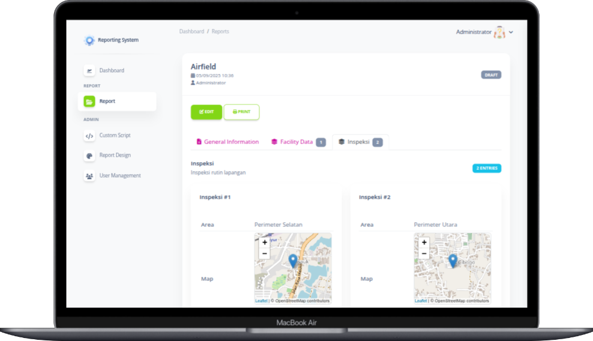
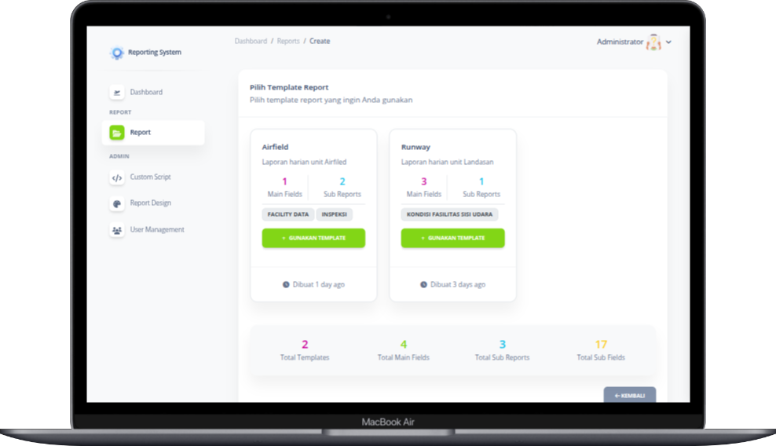
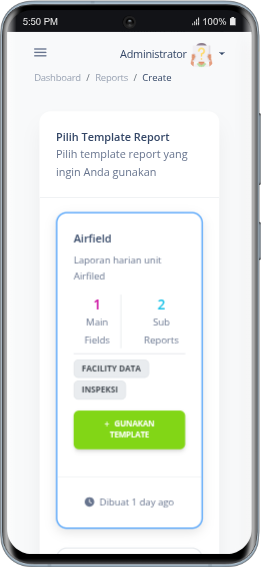

# Laravel Starter Kit with RBAC (Role Based Access Control)

**Laravel Starter Kit** ini adalah template dasar untuk memulai proyek Laravel dengan cepat, lengkap dengan fitur **Role-Based Access Control (RBAC)** dan menu dinamis yang fleksibel. Cocok untuk berbagai tipe aplikasi web yang membutuhkan sistem manajemen user, role, dan permission.  
 
## Fitur Utama

- **RBAC (Role-Based Access Control)**  
  - Kelola **role** dan **permission** dengan mudah.  
  - Assign role dan permission ke user sesuai kebutuhan aplikasi.  

- **Menu Dinamis**  
  - Buat menu sidebar / navigation yang bisa diatur lewat admin panel.  
  - Mendukung submenu dan level akses berbeda berdasarkan role.  

- **Siap Pakai di Semua Proyek Laravel**  
  - Struktur project rapi dan modular.  
  - Bisa langsung diintegrasikan ke proyek baru atau existing Laravel project.  

- **Autentikasi & Otentikasi**  
  - Login, logout, dan sistem **remember me**.  
  - Middleware siap untuk mengatur akses berdasarkan role / permission.  

- **Responsive UI & Frontend**  
  - Template menggunakan Bootstrap 5.  
  - Dukungan CSS variables untuk tema kustom dan utility class.  
  - Menggunakan template dari Soft UI Dashboard

- **Debug dan Traits Log**  
  - Track perubahan data dengan library spatie/laravel-activitylog
  - Development dengan debug bar membuat lingkungan pengembangan yang lebih mudah

## Instalasi 
<ol>
    <li>Clone repository: <code>git clone https://github.com/rachmatsumo/laravel-starter-kit.git my_project</code></li>
    <li>Buka directory: <code>cd my_project</code></li>
    <li>Jalankan: <code>composer install</code></li>
    <li>Salin file <code>.env.example</code> menjadi <code>.env</code></li>
    <li>Set konfigurasi environment di file <code>.env</code></li>
    <li>Generate app key: <code>php artisan key:generate</code></li>
    <li>Buat symbolic link: <code>php artisan storage:link</code></li>
    <li>Jalankan: <code>npm install</code></li>
    <li>Jalankan: <code>npm run build</code></li>
    <li>Jalankan migrasi dan seeder database: <code>php artisan migrate --seed</code></li> 
    <li>Jalankan server: <code>php artisan serve</code></li>
</ol>

<h2>🔑 Informasi Login</h2>
<ul>
    <li><strong>Admin</strong> 
        Email: <code>admin@local.com</code> 
        Password: <code>password123</code>
    </li>
    <li><strong>User</strong> 
        Email: <code>user@local.com</code> 
        Password: <code>password123</code>
    </li>
</ul>

<h2>📄 Lisensi</h2>

Proyek ini dilisensikan di bawah <a href="LICENSE">MIT License</a>.

 