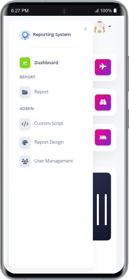

# Reporting System

Merupakan sebuah sistem pelaporan berbasis web yang dapat disesuaikan dengan kebutuhan

<h2>🚀 Instalasi</h2>
<ol>
    <li>Clone repository: <code>git clone https://github.com/rachmatsumo/reporting-system.git report_system</code></li>
    <li>Buka directory: <code>cd report_system</code></li>
    <li>Jalankan: <code>composer install</code></li>
    <li>Salin file <code>.env.example</code> menjadi <code>.env</code></li>
    <li>Set konfigurasi environment di file <code>.env</code></li>
    <li>Generate app key: <code>php artisan key:generate</code></li>
    <li>Buat symbolic link: <code>php artisan storage:link</code></li> 
    <li>Jalankan migrasi database: <code>php artisan migrate</code></li> 
    <li>Jalankan server: <code>php artisan serve</code></li>
</ol>

<h2>📄 Lisensi</h2>

Proyek ini dilisensikan di bawah <a href="LICENSE">MIT License</a>.

